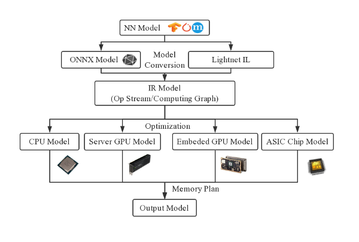

# Introduction

LightNet is a light-weight neural network inference optimizer for different
software/hardware backends.

The deep learning algorithms for various application scenarios are becoming more
and more mature. However, highly real-time algorithms in terminal devices such
as Edge Computing Devices or Autonomous Agents (such as unmanned vehicles and
drones) often require heterogeneous computing systems which are low-power and
highly real-time. Such heterogeneous computing systems generally need to be
developed with specific hardware-related languages ​​(such as CUDA, OpenCL, 
Verilog, C/C++ etc.), which have the disadvantages of low development efficiency
and long iteration period.

In order to overcome those shortcomings, LightNet refers to traditional compiler
optimization technologies, designs and develops a neural network optimizer for
heterogeneous platforms, which can accept neural network models from various 
popular deep learning frameworks, optimize them according to the user's choice 
of backend platforms, and save the optimized models which can be directly run 
by LightNet.

LightNet for now mainly focuses on the high-level optimization of a NN model, 
which can be completed with substitutions of the operators in a computing 
graph. Those optimizations are processed by the peephole optimizers and graph
substituters of the corresponding backend, according to the optimization 
capabilities provided by the backend platforms. After the high-level
optimizations, LightNet will plan the relative memory address used by each 
tensor, which can be converted to real memory address at runtime, at the same
time keep the total memory usage as low as possible.

LightNet essentially is an end-to-end NN optimizer framework that can be easily
extended to support different model formats and backend computing platforms.
However there are 3 diversification problems when designing such an optimizer
which leads to enormous coding efforts: 

  * diversification of model formats, such as Tensorflow's checkpoint, 
    Pytorch's pt.
  * diversification of operators, operators are highly diverse and new operators
    are emerging.
  * diversification of operator optimization capabilities of different backend 
    platforms.

LightNet provides 3 methods to solve those problems respectively:

  * a unified model format and conversion tools for various frameworks
  * an operator description language and code generation tools
  * an optimizer description language and code generation tools

Combined with the above methods, LightNet can be easily extended to support 
different model formats, all kinds of operators, and various backends with different
optimization capabilities, to realize the rapid construction and automatic
optimization of NN models.

LightNet's core architecture is developed with C, which has the advantages of 
light weight, high efficieny and unified binary interface, which can be easiy 
combined with other languages and deployed in various hardware platforms.
